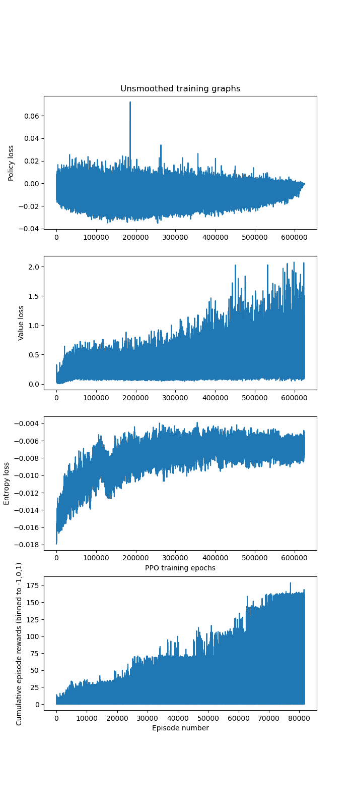

This is a simple implementation of PPO.

All hyperparams and settings are global variables in the fiels (agent.py and ppo.py).
To run on different environments, change the ENVIRONMENT variable in agent.py
and (any corresponding hyperparameters) and then run 
python ppo.py

Below is a video of the agent playing space invaders!

And this is a graph of the unsmoothed training curves the 40M frames of training space invaders:

